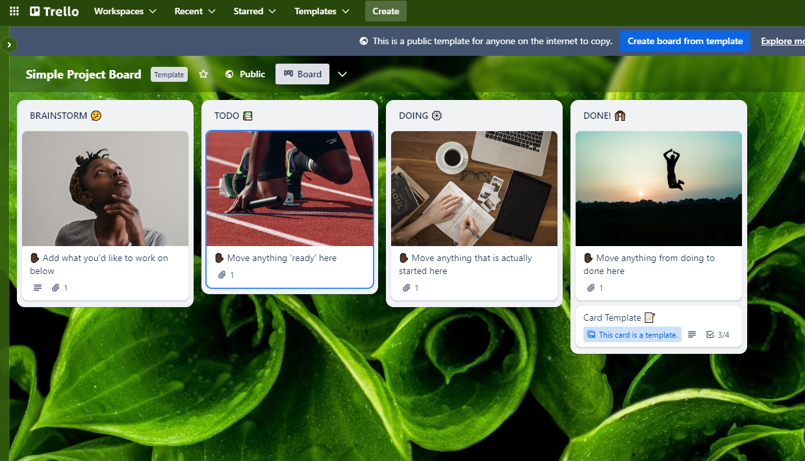
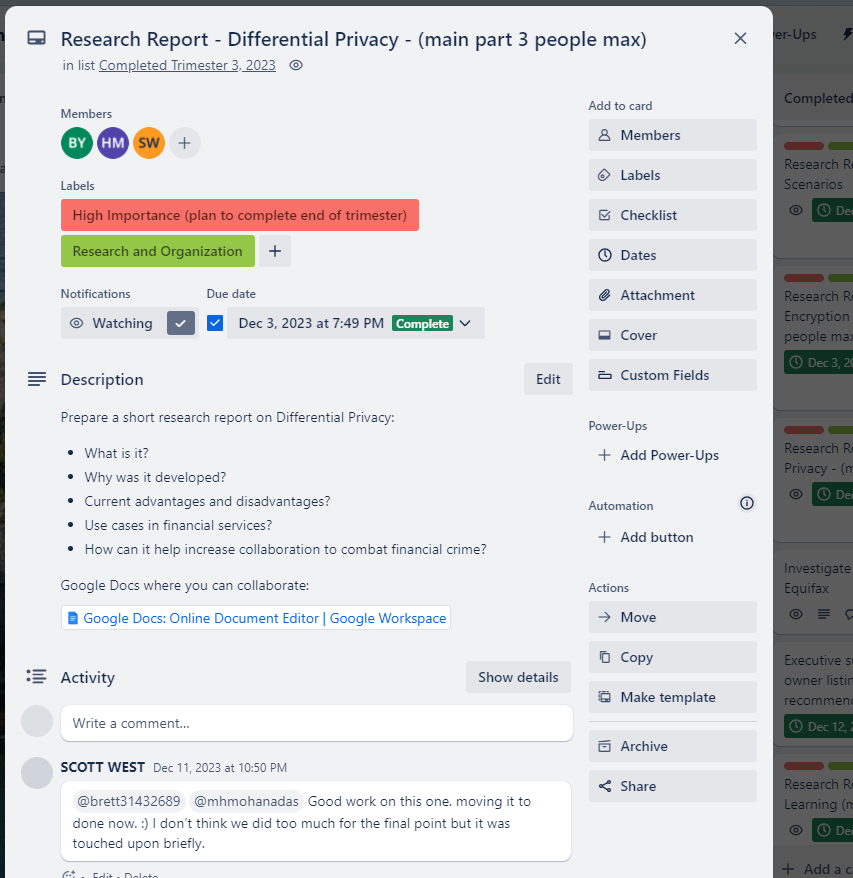
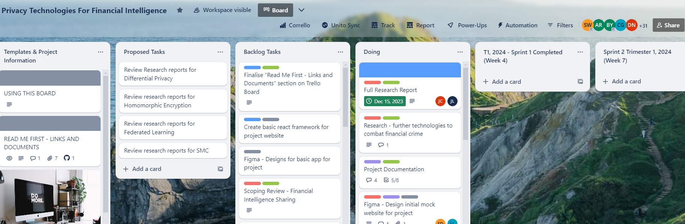

## Welcome!

Welcome to our quick start guide to Trello! This document is your gateway to mastering Trello for
enhanced project management and team collaboration.

## What is Trello?

Trello is a popular visual collaboration and workflow management tool that creates a shared
perspective on any project. Trello’s boards, lists, and cards enable you to organize and prioritize
your personal and work life in a fun, flexible, and rewarding way. Owned by the Sydney based
software company Atlassian. Essentially it provides a productivity dashboard, facilitating effective
oversight and organisation of Information Technology projects. Trello workflows assist with a
variety of tasks including: organising meetings, onboarding new members, task management,
brainstorming, along with providing a resource hub (Atlassian Trello 2024).

## Getting Started

To begin using Trello, you need to create a free account at [Trello.com](https://trello.com). Once
you've set up your account, you can start creating boards, adding cards, and inviting team members
to collaborate.

## Watch our Video Tutorial

Watch our video tutorial below to gain an overview of Trello. Covered in the video is the history of
Trello, why we use the technology for capstone, and the primary features.

_Link: https://youtu.be/-tHwW7DghgE_

## History of Trello

- Trello was initially developed by Fog Creek Software in 2011 to assist Information Technology
  teams with effective workflow management.
- By 2012, Trello reached 500,000 members and launched the Trello Android App. Consistently growing
  in popularity, Trello went public in 2014, and by the summer of 2015 had gone International with a
  presence in Brazil, Germany and Spain.
- In early 2017, Trello was acquired by the Australian Software Company Atlassian. Atlassian is one
  of the largest software companies in Australia and provides collaboration software for Information
  Technology and Business teams. This includes work management, IT service Management along with
  Agile and Development solutions (Atlassian 2024).
- Since being purchased by Atlassian, Trello has consistently grown its user base and refined its
  features. Now, Trello is one of the most popular workflow management tools in the world with
  millions of customers. Prominent companies such as Google and Visa pro-actively use Trello for
  managing their workflows (About Us, Trello 2024).
- On social media, the parent company Atlassian is a great company to follow for news and updates on
  the technology industry.

## Why do we use Trello in Capstone?

Trello is a great fit for capstone due to its workflow management capabilities. Boards are a one
stop shop where you have an overview of everything going on within a capstone project. Therefore,
capstone students can easily organise a project in the one place. Real-world practicality and ease
of use for project management is facilitated through Trello.

Trello is currently being utilised by many large, reputable companies for workflow management. This
provides you as a capstone student, an opportunity to gain some experience with a prominent project
management solution currently being used across the Information Technology industry.

Additionally, it is relatively easy to use. It doesn’t require any coding knowledge to learn the
basic functionality. There are many resources online to help with setting up your first Trello Board
and learning the main features.

Finally, Trello offers lots of functionality and cross-collaboration with other technologies to
effectively manage your workflows. Smart links and integrations with other prominent technologies
including: Microsoft Teams and Github are offered through powerups.

## Main Features

Trello has a large array of functionality at its disposal to allow for the effective management of
an Information Technology Project. Features are designed to seamlessly set up and customise
workflows allowing you to work on and organise anything. There are the three main features you need
to understand to use Trello effectively for a capstone project: Boards, Lists and Cards.

### Boards

Boards provide a high-level overview of an Information Technology project. A project board will
allow team members to holistically monitor everything that is going on. They can see who is assigned
to work on certain tasks, timeframes for completing work along with the status of particular tasks
(i.e. which tasks have not been assigned, are currently being worked on and have been completed for
the project). It also allows team members to effectively collaborate, access essential project
resources and view deadlines.

Most of the Capstone companies already have a Trello Board for their projects. Therefore, it is
critical to familiarise yourself with the Board to understand the project workflow and collaboration
style. If you need ideas to create a new Trello Board or refine an existing one, there are several
great templates provided which are well suited to a capstone project. Some Trello templates provided
for boards include: _“Project Management”, “Kanban”, “Simple Project Board”, and “Remote Team Hub”_.
For anyone creating their first Project Board, a _Simple Project Board_ is a good board to start
with. A screenshot of this board is below for reference:

 _Figure 1: Trello Simple
Project Board_

### Cards

Within the Trello Framework another key aspect for managing workflows is Cards. A card is created to
document a project task or idea which requires actioning. Cards hold all the information and
collaboration material for that aspect of the project. Examples of cards could be completing
research for the project (e.g. _“Research Trello Feature X”_), an idea to assist team members (e.g.
_“Discuss Trello Feature X”_), resources requiring documentation (e.g. _“How to Use Trello Feature
X”_) or building a technical feature for the project (e.g. _“Draft Web page X”_ or _“Build ML Model
for X”_). Cards can also be created to resource important project information (e.g. A card named
_“Getting Started on this project”_).

Once card documentation is complete, it can be assigned to a particular team member and organised
through tools such as labels, deadlines and notifications. An example of a real-life Trello Card is
shown below for completing research on Differential Privacy from the Capstone Company Data Bytes.

_Figure 2: An Example Capstone Trello Card_

### Lists

Lists help efficiently organise cards into their stage within the project. Lists can be created to
group similar tasks together based on common features. Within capstone you could create a list
called _“To Do”_, incorporating all the tasks that are to be completed by the end of a particular
sprint. Or a list called _“Brainstorm”_ which houses all the ideas proposed for the project
requiring discussion with project leadership before implementation. Five lists that can be created
to start organising cards for a project include: _“Project Information”, “Brainstorm”, “To Do”,
“Doing” and “Done”_. An example of a group of lists from the Capstone company Data Bytes is shown
below in Figure 3.

_Figure 3: An example of Capstone Lists_

## Conclusion

In summary, Trello is a versatile tool for managing projects, tasks, and teams. Whether you're
planning a complex project or tracking your daily to-dos, Trello can help you visualize your
progress and achieve your goals. Understanding the lists, boards and cards is important so ensure
you spend some time famliarising yourself. Also check out this excellent overview of Trello Video
for more information: (https://www.youtube.com/watch?v=l3F3l3psqXY).

## References

- _‘Trello helps teams move work forward’_, Trello Home, Atlassian 2024, accessed 3rd of February
  2024, _[Trello](https://trello.com/tour)_
- _‘What is Trello’_, Trello Home, Atlassian 2024, accessed 3rd of February 2024,
  _[What is Trello: Learn Features, Uses & More | Trello](https://trello.com/tour)_
- _About Trello_, Atlassian 2024, accessed 3rd of February 2024,
  _[About Us: Trello History, Logos & Customers | Trello](https://trello.com/about)_
- Cannon-Brookes M. (published January 9th, 2017, in Company news), _‘Atlassian + Trello: changing
  the way teams work’_, Atlassian Blog 2023, accessed 3rd of February 2024,
  _[Atlassian + Trello: changing the way teams work - Work Life by Atlassian](https://www.atlassian.com/blog/announcements/atlassian-plus-trello)_
- Trello (2023), _Boost your Productivity with Trello_, Atlassian 2023, Available at:
  *https://www.youtube.com/watch?v=yDlDdTp7p6Q* (Accessed 23rd of June 2023)
- Trello (Published: 3rd of January 2020), _‘What's a Trello Board? | Start Here: Trello Tutorial’_,
  Atlassian 2024, Available at: *https://www.youtube.com/watch?v=l3F3l3psqXY* (Accessed 10th of
  February 2024).
