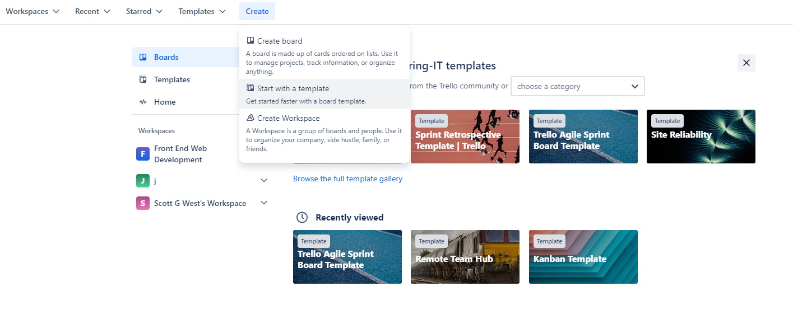
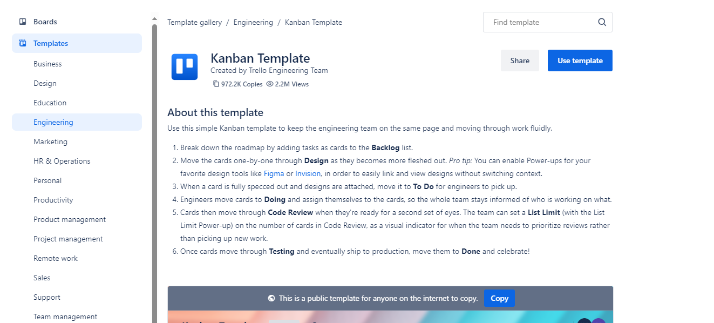
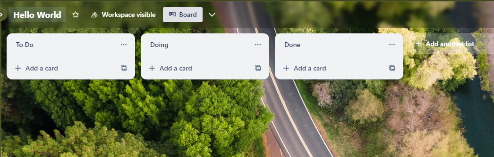
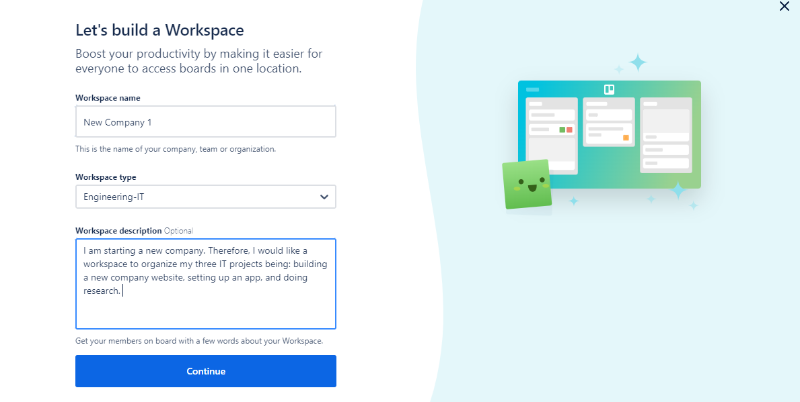
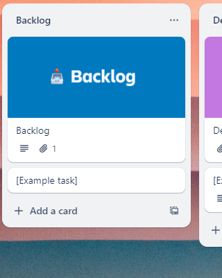
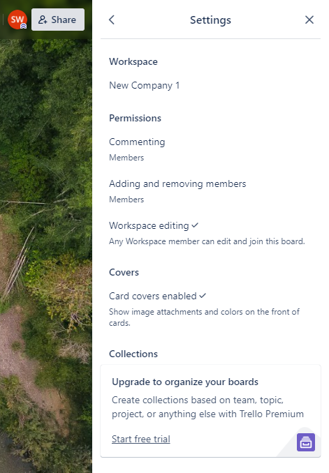
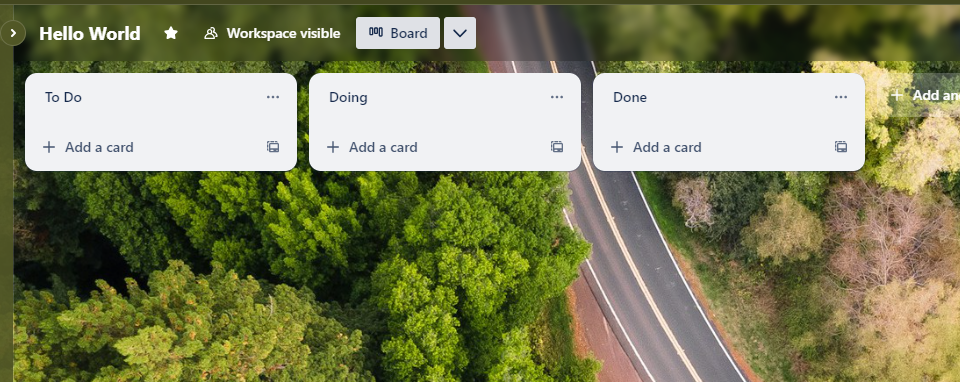

## Overview

In this chapter, we'll guide you through creating a board in trello for organizing a project. Once
you have created an account and logged into Trello, you can create a Trello Board through selecting
the tab “Create” at the top of the screen. From here you can select one of three options to create
the board: _Create board_, _Start with a template_ and _Create Workspace_. Once the board is
created, the next step is to add cards and review the main settings.

_Figure 1: Create a Trello Board_

## Watch our Video Tutorial

Watch our video tutorial to learn how to create a project board within Trello and customise the main
settings.

_Link: https://youtu.be/4Qvctrpmveg_

## Steps for Creating a Board

1. Log into your Trello account.
2. Click the _Create_ button in the top right corner.
3. Choose either: _Create new board, Start with a template, or Create Workspace_.
4. Select a Background, Name your board, Choose a Workspace, and set the visibility.
5. Click "Create" to get started.

## Board Creation Options

Now you know the steps to create your first Trello board, let's further explore the three board
creation options.

### Start with a Template

When creating a new Board as a capstone student, a good place to start is to peruse the existing
Trello Board Templates to try and find a suitable one. Two good categories to peruse for selecting
an ideal template are: _Engineering_ and _Project Management_. Note that when creating a template, a
recommendation is to use the cards as a guide and set the visibility to _Workspace_.

For working in a Capstone company there are two Trello Boards that are good general templates. One
is the Trello Agile Sprint Board Template which is divided into four lists being: _‘Backlog’,
‘Sprint Backlog’, ‘In Progress’ and ‘Sprint – Complete’_. Another relevant option for Capstone is
the Kanban template organizing tasks into the lists: _‘Backlog’, ‘Design’, ‘To Do’, ‘Doing’, ‘Code
Review’, ‘Testing’ and ‘Done’_. However, there are many other project templates tailored to a
variety of tasks so ensure you explore what is on offer.

_Figure 2: Selecting the Kanban Template_

### Create a Board from Scratch

Creating a Trello Board from Scratch means creating a brand-new board with no template features such
as lists, cards or functionality. Instead, any organisational features must be written. This can be
a good option if none of the template Trello Boards are relevant to the new project, or you cannot
decide which template to use. Through this option a team member can customise the board to their
unique project, team members and circumstances. There is also less template information to go
through.

_Figure 3: Creating a Board from Scratch_

### Create a Workspace

A workspace is a group of Trello Boards that can be collectively managed together. This option has
merit if you have multiple new projects within the company to run or would like to start a new
company from scratch. If you are pursuing this option there are a few aspects to note. The workspace
name should be either the new company name or a name representing the projects. The workspace type
should be “Engineering-IT”, and the workspace description should be a short-written summary
encapsulating the company mission and projects.

_Figure 4: Create a Workspace_

## Setting Up the Board

### Creating Project Cards

**Adding Cards:** Click "Add a card" at the bottom of any list to add new tasks or items.

Once you have selected a template it is a good idea to add the project tasks and ideas as cards into
the backlog list. This can be done through selecting _Add a card_. When commencing a new project, it
is recommended to add all the proposed tasks as cards within a list called _Proposed Tasks_ to be
discussed in the team meeting. If the team decides to continue with certain tasks, the card can be
moved to the _Backlog_ list for allocation and actioning.

_Figure 5: Creating new Project Cards_

### Main Settings

Once the board has been created with important project cards a good next step is to review the board
settings. If you click the three dots on the right-hand side, then settings you can organise the
workspace name and permissions.

_Figure 7: Important Features_

Further, the top left-hand side of the page allows you to change the board name, visibility and star
for importance. Clicking into the board name allows you to amend. Starring the board gives the board
prominence which is a good idea for boards currently being worked on. Visibility can also be amended
from here in line with the privacy priorities of the project.

_Figure 8: Board Settings_

## Conclusion

Creating a board in Trello is the first step towards project management success. With your board set
up, you're ready to start working on and organising the project. Great work!
