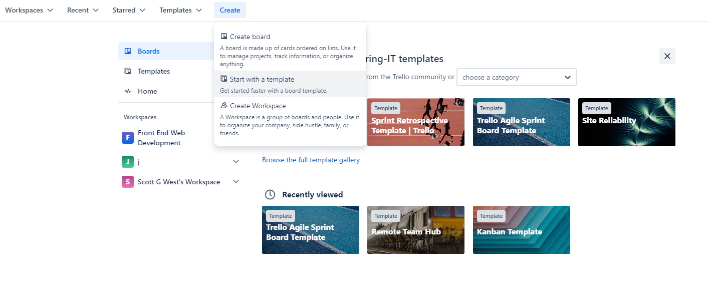
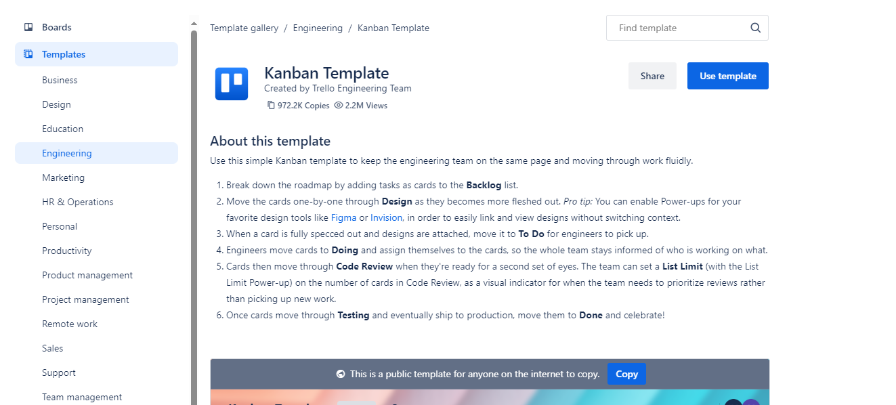
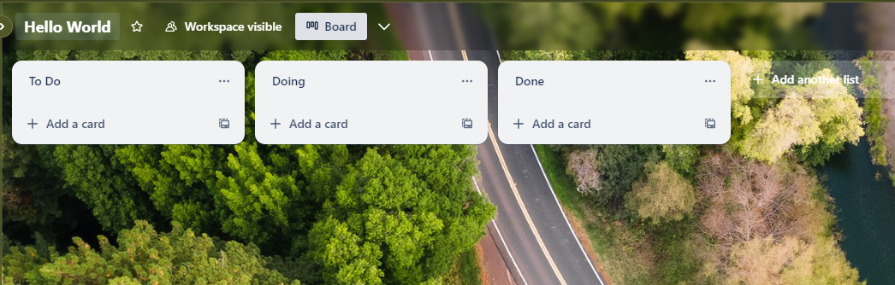
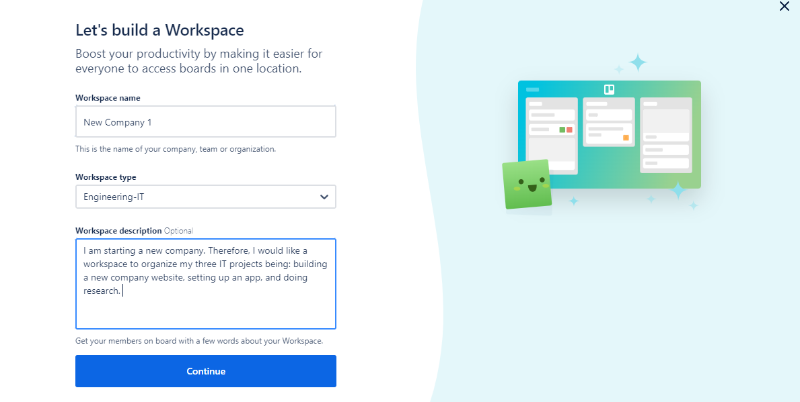
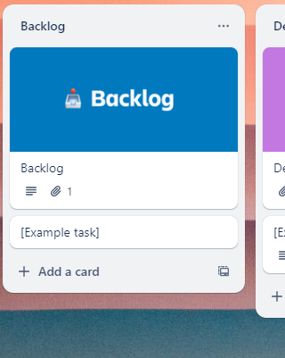
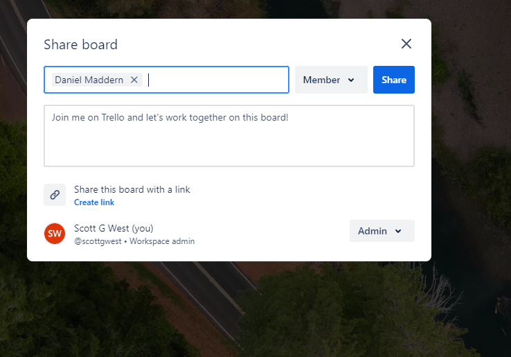
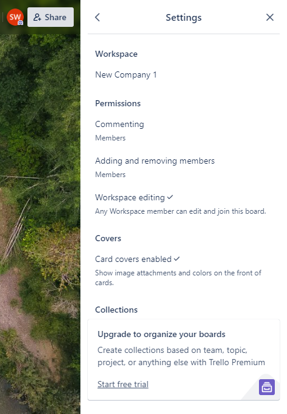
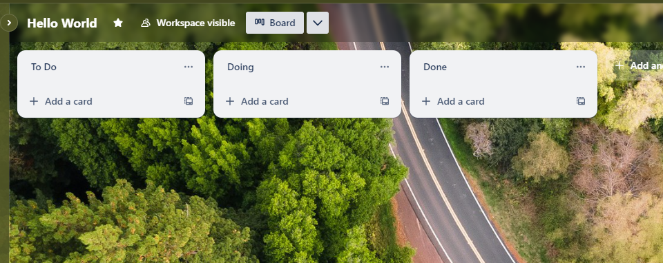

# Creating a Capstone Trello Board

## Overview

In this chapter, we'll guide you through the steps to create a board in Trello, the first step towards organizing your projects. Once you have created an account and logged into Trello, you can create a Trello Board through selecting the tab “Create” at the top of the screen. From here you can then select one of three options to create the board being: Create board, start with a template, and create Workspace. Note that when creating a template, it is a good idea to keep the template cards as a guide and set the visibility to workspace.

_Figure 1: Create a Trello Board_

## Watch our Video Tutorial

Gain an overview of Creating a Project Board within Trello along with board options and settings. 

*Link:*

## Steps for Creating a Board

1. Log in to your Trello account.
2. Click the "+" button in the top right corner and select "Create new board."
3. Name your board, select the board option, choose a background, and set its visibility.
4. Click "Create Board" to get started.

Let's further explore the board options below. 

### Start with a Template

When creating a new Board as a capstone student, a good place to start is to peruse the existing Trello Board Templates to try and find a suitable one. Two good categories to peruse for selecting an ideal template are: Engineering and Project Management.

For working in a Capstone company there are two Trello Boards that are good general templates to use. One is the Trello Agile Sprint Board Template which is divided into four lists being: _‘Backlog’, ‘Sprint Backlog’, ‘In Progress’ and ‘Sprint – Complete’_. Another good relevant option for Capstone is the Kanban template. This organises tasks into the lists: _‘Backlog’, ‘Design’, ‘To Do’, ‘Doing’, ‘Code Review’, ‘Testing’ and ‘Done’_. However, there are many other templates including Web Development, Software Development and Game Development so ensure you have a look around.

_Figure 2: Selecting the Kanban Template_

### Create a Board from Scratch

Creating a Trello Board from Scratch means creating a brand-new board with no template features such as template lists, template cards or functionality. Instead, any organisational features must be written from scratch. This can be a good option if none of the template Trello Boards are relevant to the new project, or you cannot decide which template to use. A possible example is a non-standard project which requires both game development and web development. Through this option a team member can better tailor the board to their unique project, team members and circumstances compared to using a template. There is also less convoluted template jargon to go through and organise.

_Figure 3: Creating a Board from Scratch_

### Create a Workspace

A workspace is a group of Trello Boards that can be collectively managed together. This option has merit if you have multiple new projects within the company to run or would potentially like to start a new company from scratch.

If you are pursuing this option, there are a few aspects to note. The workspace name should be either the new company name or a name representing the multiple projects being run.

Since within Capstone IT projects are being run the workspace type should be “Engineering-IT”. Workspace description should be a short-written summary which encapsulates the company mission and lists the projects which will be run as part of this workspace.

_Figure 4: Create a Workspace_

## Setting Up the Board

### Creating Project Cards

**Adding Cards:** Click "Add a card" at the bottom of any list to add new tasks or items.

Once you have selected a template it is a good idea to add the project tasks and ideas as cards into the backlog list. This can be done through selecting ‘Add a card’. When commencing a new project, it is a good idea to add all the proposed tasks as cards to be discussed in the team meeting. If the team decides to continue with that task, it can then be moved to one of the next lists for allocation and actioning.

_Figure 5: Creating new Project Cards_

### Collaboration in Trello

Trello shines as a collaborative tool, enabling teams to work together seamlessly and ensuring everyone is on the same page. To effectively collaborate and start project work you will need to invite the other team members to the project board. If you select the ‘Share’ option in the top right-hand corner this will allow you to add all the project team members who will be using the board for the trimester.

*Inviting Team Members:*

- **To invite someone:** Open your board’s menu, navigate to "Invite," and enter their email address.

*Collaboration Features:*

- Comment on cards to discuss tasks.
- Use @mentions to notify specific members.
- Share boards with stakeholders.

_Figure 6: Collaboration in Trello_
 
### Primary Board Settings
Once the board has been created with important project cards a good next step is to review the board settings. If you click the three dots on the right-hand side and then settings a team member can organise the workspace name and permissions. The board name can be changed through clicking into the top left-hand side of the board page. Starring the board is a good option during the capstone Trimester. Visibility can also be changed from here in line with the privacy priorities of the project.

_Figure 7: Important Features_

_Figure 8: Board Settings_

## Conclusion

Creating a board in Trello is the first step towards project management success. With your board set up, you're ready to start adding lists and cards to organize your tasks and ideas.
