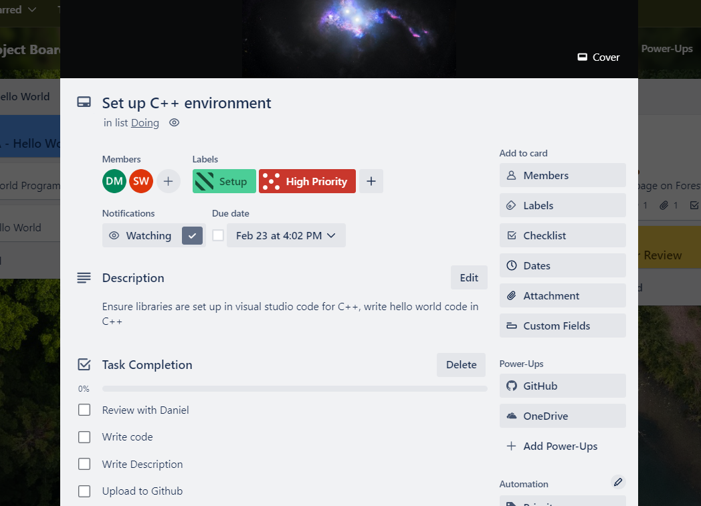
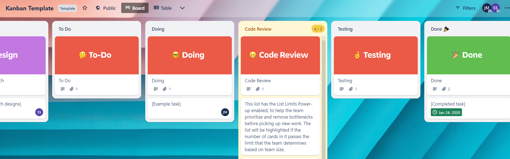
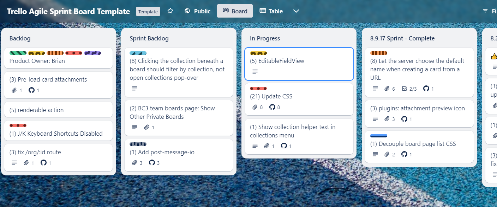
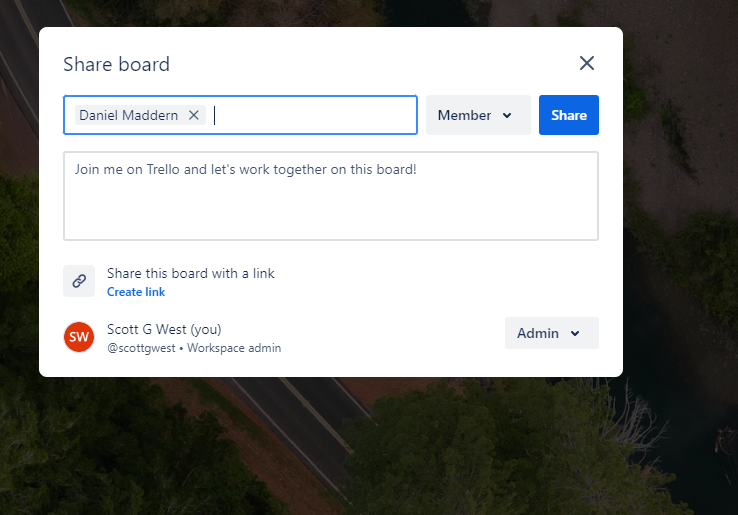
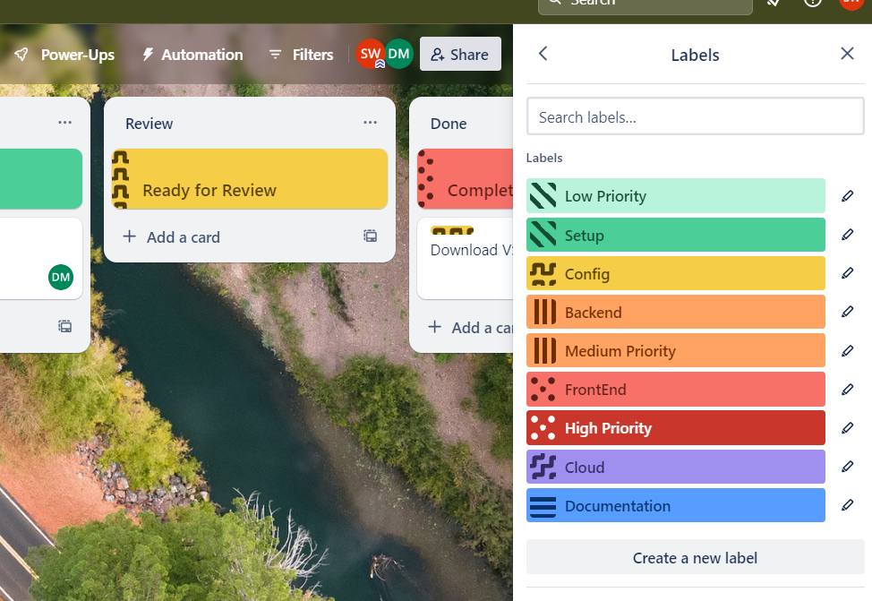
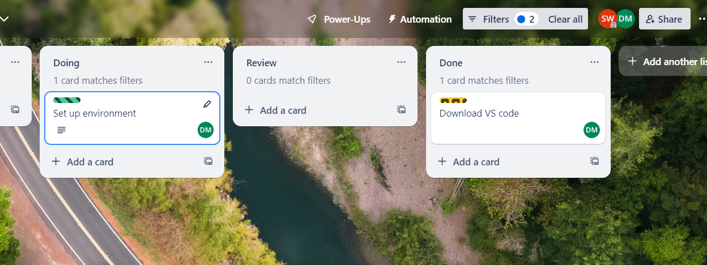
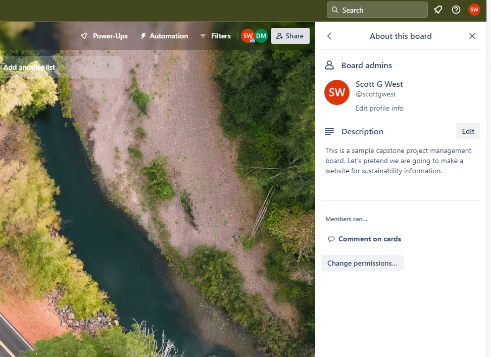
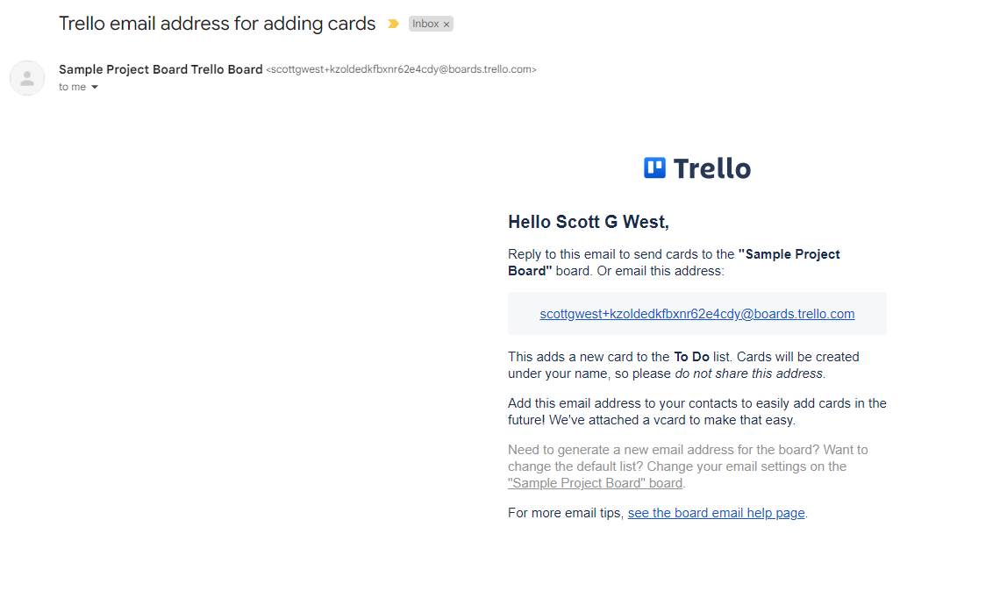

## Overview

Now that we have created a Trello Board, let’s go over effectively managing a Trello Board for the
Deakin University capstone program. Learning the general Trello Workflow, managing cards and lists
will be covered. Labels, filters and board settings will also be explored for enhanced organisation.

## Watch our Video Tutorial

Watch the below video to learn how to manage the Trello Board effectively.

_Link: https://youtu.be/4FO6Knp0U8k_

## Overview of Workflows in Trello

A well-defined and customised workflow in Trello helps keep your project organized and on track,
significantly improving project efficiency.

_Setting Up Your Workflow:_

- Define your project stages as lists,
- Create cards representing tasks and move them across lists to track progress,
- Use card features for organisation,
- Integrate advanced features such as Power-Ups for automation and enhanced organisational
  functionality.

## Managing Cards

In essence, each Trello card should encapsulate a capstone task to be completed within one sprint by
between one to three team members. Each card should have a short description of the work required
along with a checklist of items to be completed to finalise the card. A capstone task should be
equivalent to one user story from the requirements analysis stage.

**Adding Cards**

Cards are the individual tasks or items within each list. To add a new card:

1. Click "Add a card" at the bottom of the list where you want the card to appear.
2. Enter a title for your card, which should succinctly describe the task or item.
3. Press Enter to add the card to the list.

The following features are required in a card:

- **Members**: Assign the team members actioning the card.
- **Checklists**: Actions required to complete the card.
- **Dates**: The due date to the card, this should be a particular sprint end date.
- **Attachments**: Any relevant attachments required to complete the card.
- **Cover**: Capstone team members can insert a cover photo to represent the card.

_Figure 1: A Sample Capstone Trello Card_

## Managing Lists

**Creating Lists:** Click the "Add another list" button on your board to start a new list. Enter the
list name and press enter. It is recommended to place a card at the top of the list for descriptive
purposes.

There are two great Trello List Template options for a capstone student:

- **The Agile Sprint Template** consisting of the following lists: Project Information, Possible
  Tasks, Backlog, Sprint Backlog, Doing, Review, Sprint Complete.
- **The Kanban Template** with the lists: Project Information, Possible Tasks, Backlog, Design, To
  Do, Doing, Code Review, Testing and Done.

_Figure 2: The Kanban Template_

_Figure 3: The Agile Sprint Template_

### Templates and Project Information

It is recommended to have a _Templates and Project Information_ list on the capstone board. Located
on the far-left, this list will house information required for effective project management. Some
suggested cards are are below.

**Suggested cards:**

- **Using this board:** This card can house information on using the Trello board effectively. For
  example, Scrum rules can be detailed through this card. Information on the backlog, creating a new
  card, the leadership team along with how to operate successfully within the general scrum
  framework can be included;
- **Read Me First - Links and Documents:** This card will contain general links and documents so
  that new team members can seamlessly get up to speed with the project. Recent handover
  documentation, showcase videos, designs, onboarding checklist and project tutorials should be
  included within this card;
- **Tips & Tricks:** A place where team members can share any helpful hints or IT tips to
  successfully work on the project;
- **Upskilling for this Project:** This card should contain learning courses relevant to the
  capstone company and project. For example it could contain LinkedIn Learning paths such as:
  _Become a Data Analyst, Become a Data Scientist_, or _Become a Full Stack Web Developer_.

## Collaboration in Trello

Trello shines as a collaborative tool, enabling teams to work together seamlessly and ensuring
everyone is on the same page. To effectively collaborate and start project work you will need to
invite the other project stakeholders to the project board. If you select the ‘Share’ option in the
top right-hand corner this will allow you to add all the project stakeholders who will be using the
board for the trimester. Sharing the board with a link is valuable if you need to add many new
stakeholders.

_Collaboration Features:_

- Comment on cards to discuss tasks.
- Use @mentions to notify specific members.
- Share boards with stakeholders.

_Inviting Team Members:_

- **To invite someone:** Select the _Share_ option in the top-right hand corner and enter the
  stakeholders name or email address.
- **To share the Board:** Click the _Share_ option in the top-right hand corner; Select create link;
  Copy link and share to the other collaborators.

_Figure 6: Collaboration in Trello_

**Commenting on Cards**

Comments are crucial for discussion and updates on tasks:

- Click on a card to open it.
- Scroll to the "Add Comment" section.
- Type your comment and press Enter or click "Save."

Use comments to provide feedback, ask questions, or update the team on progress.

**Using @mentions to Notify Members**

Get the attention of specific team members:

- In a card comment or description, type "@" followed by the team member's name.
- Select the correct person from the dropdown list.
- They will receive a notification about the mention.

@mentions ensure that messages reach the relevant team members quickly.

**Sharing Boards with Stakeholders**

To involve stakeholders who need visibility into the project:

- Ensure your board’s visibility settings allow for sharing.
- Invite stakeholders as members or observers, depending on the level of access you wish to grant.

**Effective Collaboration Practices**

- **Regular Updates**: Encourage team members to regularly update cards with their progress.
- **Board Meetings**: Consider holding short, periodic meetings to review the board together,
  ensuring alignment and addressing any blockers.
- **Clear Guidelines**: Establish conventions for using labels, setting due dates, and assigning
  tasks to streamline communication and expectations.

## Labels

Creating labels for the Trello Board is handy for effective project organisation. Trello Labels help
capstone students with organising, prioritising, and categorising cards. Labels can be created
through the menu tab on the right-hand side of the board. It is recommended to have two sets of
labels. One for the prioritization of tasks and another for task categorization.

_Prioritization categories:_

- Low priority (light green, does not need to be done by the end of trimester)
- Medium priority (orange, aiming to completed by the end of the trimester)
- High priority (red, aiming to completed by the end of the next sprint)

_Task categories - Suggestion 1:_

- Setup (dark green)
- Config (yellow)
- Backend (orange)
- FrontEnd (red)
- Cloud (purple)

_Task categories - Suggestion 2:_

- Web Development (dark green)
- Data Science (yellow)
- Research (orange)
- Organisation (red)
- Trello (purple)

**Enable Colour blind Friendly Mode**

A further feature to consider is to enable the colour-blind friendly mode on the labels. Doing so
places speciality features on each of the labels making them viewable for collaborators who are
colour-blind.

_Figure 4: Sample Capstone Labels_

## Filters

Filters in Trello can be used to effectively manage a Trello Card. This feature allows you to sort
through cards based on selected criteria. For example, as a capstone student you could filter tasks
that are due by the end of the next sprint.

_Figure 5: Filtering by cards assigned to Daniel_

Trello cards can be filtered in two ways through either any or an exact match. Any match means that
a card matches any label and any feature selected. In contrast, an exact match means that only cards
will be displayed that match all the labels and features selected. If you are not sure which to
select, the Any Match filter is a good starting point.

## Updating Board Settings

An important aspect of the Trello Board to review is the board settings. Clicking on the three dots
to the right-hand side of the board displays the menu section. From here, a team member can engage
in various board management activities including: adding a description, monitoring activity, and
reviewing the settings. There should always be a description of the board. To add one, first click
on about this board and description.

_Figure 6: Updating the Board Description_

The settings section further allows the user to organise the Workspace, Permissions and Covers. From
here, you can watch, copy, close, print, export and share the Trello Board. These are handy features
if you would like to collaborate with others using the Trello board. Another settings feature is the
email to board. This feature emails the user the Trello Board allowing them to directly add cards to
the board through their email. Custom fields are an advanced feature only available through Premium,
allowing you to create customised card features such as text fields and more.

_Figure 7: Email to Board Feature_

## Conclusion

Effectively managing your Trello board transforms it into a dynamic tool for visualizing and
controlling project workflows. By adding and organizing lists and cards, utilizing labels, and
assigning tasks, your board becomes a central hub for project management and team collaboration. You
have now gone over key functionality to manage the Trello Board effectively during your capstone
experience. Managing your Trello board effectively can streamline your project workflow, making it
easier to track progress and collaborate with your team. Good work!

## References

- Trello (Published June 16, 2020), _Trello labels: how to organize, categorize, and prioritize
  cards_, Trello Blog, Atlassian 2023, accessed 3rd of February 2024,
  _[Trello labels: how to organize, categorize, and prioritize cards - Work Life by Atlassian](https://www.atlassian.com/blog/trello/taco-tuesdays-learning-to-love-labels#:~:text=More%20Quick%20Tips%20For%20Using%20Trello%20Labels%201,which%20you%20would%20like%20to%20filter.%20More%20items)_
- Zoho Desk 2024, _5 Project Management: Product Management Buckets_, Trello 2024, accessed 3rd of
  February 2024,
  *https://trello.com/templates/product-management/5-product-management-buckets-H8rDCB7e*
