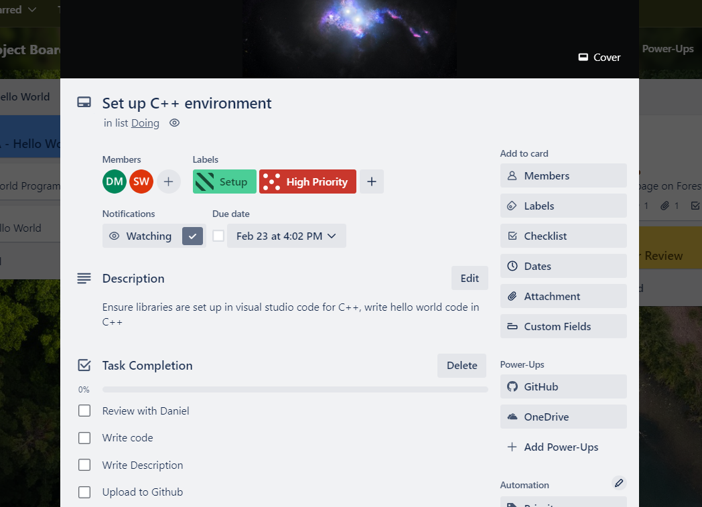
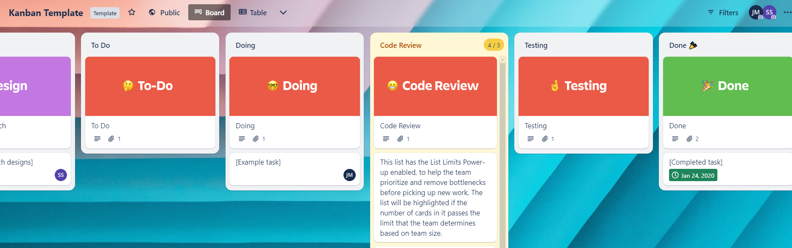
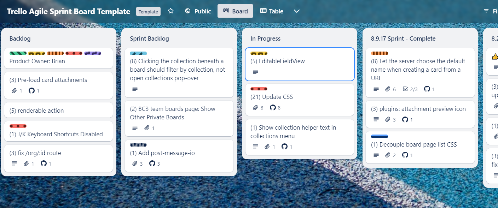
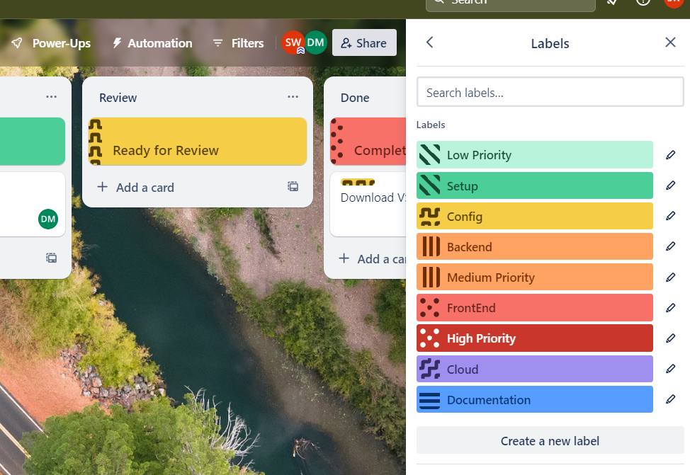
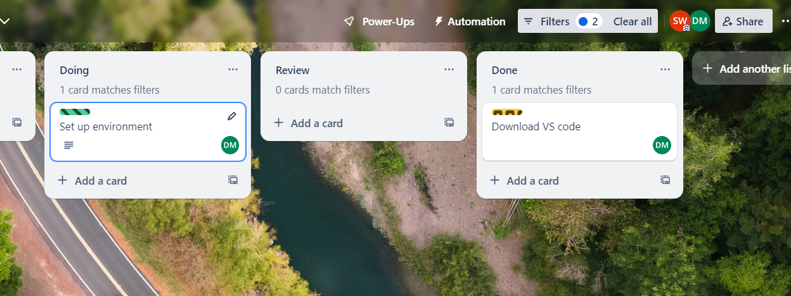
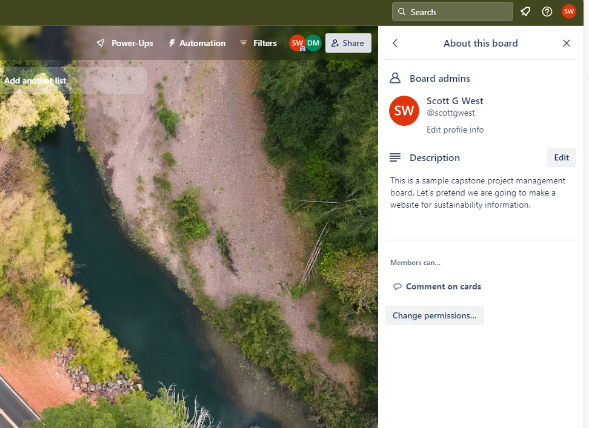
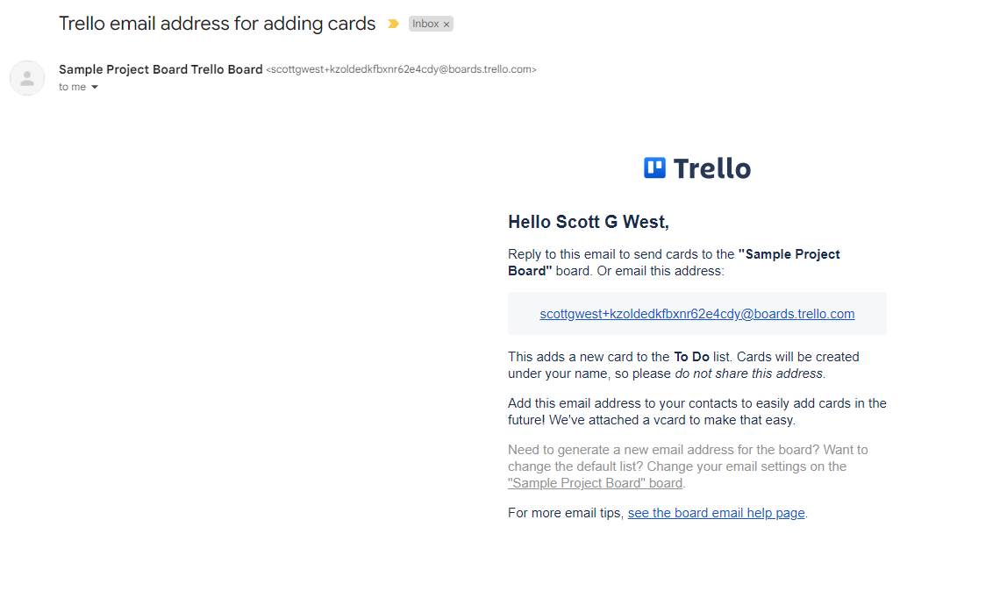

# Managing the Trello Board

## Overview 

Effective board management is key to making the most out of Trello. This chapter covers how to add lists, cards, and organize your board efficiently.

Now that we have created a Capstone Trello Board in the last tutorial, let’s go over some features for effectively a Trello Board. Learning to set up and manage cards and lists effectively is essential for success during capstone. Labels and filters will also be explored for maximum organisational capacity. Finally we will go over customizing the settings for a Capstone University Trello Board.

## Watch our Video Tutorial

Learn how to manage the Trello Board effectively though a variety of features by watching the below video. 

*Link:*

## Workflows in Trello

A well-defined  and customised workflow in Trello helps keep your project organized and on track, significantly improving project efficiency. Here are some tips to manage your workflow during capstone.

*Setting Up Your Workflow:*
- Define your project stages as lists,
- Create cards for tasks and move them across lists to track progress.

*Customizing Workflows:*
- Use labels to indicate task status,
- Integrate Power-Ups for automation and enhanced functionality.

## Managing Cards

In essence, each Trello card should encapsulate a capstone task to be completed within one sprint by between one to three team members. Each card should have a short description of the work required along with a checklist of items to be completed to finalise the card. A capstone task should be equivalent to one user story from the requirements analysis stage.

The following features are required in a card:

- **Members**: Assign the team members actioning the card.
- **Checklists**: Items required to complete the card.
- **Dates**: The date on the card should be end date of the sprint end date.
- **Attachments**: Any relevant attachments about the task should be included in this section.
- **Cover**: Capstone team members can insert a cover photo to represent the card.

_Figure 1: A Sample Capstone Trello Card_

## Managing Lists

**Creating Lists:** Click the "Add another list" button on your board to start a new list. A new list can be created through entering a list name into the add another list bar on the far right-hand side and pressing enter. Once this has been done. It is a good idea to put a Trello card at the top of the new list for a description.

There are two great Trello List Template options for a capstone student:

- **The Agile Sprint Template** consisting of the following lists: Project Information, Possible Tasks, Backlog, Sprint Backlog, Doing, Review, Sprint Complete.
- **The Kanban Template** with the lists: Project Information, Backlog, Design, To Do, Doing, Code Review, Testing and Done.

_Figure 2: The Kanban Template_

_Figure 3: The Agile Sprint Template_

### Templates and Project Information

It is also a good suggestion to create a Templates and Project Information list. This list will house information on the project required by the team members. For example, information on using the board, upskilling, templates and tricks, and onboarding documents for new team members to be across. Below are some suggestions for cards to have within this list. These cards have been used in previous projects.

**Suggested cards:**

- **Using this board:** This card can house information on using the Trello board. Scrum rules can be detailed through this card. Information on the backlog, creating a new card, the leadership team along with how to operate successfully within the general scrum framework.
- **Read Me First Links and Documents:** This card will contain general links and documents so that new team members can seamlessly get up to speed with the project. Most recent handover documentation, showcase videos, designs, onboarding checklist and project tutorials should be included within this card.
- **Tips & Tricks:** One of the simplest cards to implement, a place where team members can share any helpful hints or IT tips to successfully work on the project.
- **Upskilling for this Project:** This card should contain learning courses so that new team members can learn the necessary skills required for their capstone project. It contains LinkedIn Learning paths such as: Become a Data Analyst, Become a Data Scientist, or Become a Full Stack Web Developer.

## Labels

Creating labels for the Trello Board is a handy for effective capstone project organisation. Trello Labels help capstone students with organising, prioritising, and categorising cards. Labels can be created through the menu tab on the right-hand side of the board. One suggestion in capstone is to have two sets of labels. One set of labels for the prioritization of tasks and another for categorization of activities.

_Prioritization categories:_

- Low priority (light green, does not need to be done by the end of trimester)
- Medium priority (orange, aiming to completed by the end of the trimester)
- High priority (red, aiming to completed by the end of the next sprint)

_Task categories Suggestion 1:_

- Setup (dark green)
- Config (yellow)
- Backend (orange)
- FrontEnd (red)
- Cloud (purple)

_Task categories Suggestion 2:_

- Web Development (dark green)
- Data Science (yellow)
- Research (orange)
- Organisation (red)
- Trello (purple)

**Enable Colour blind Friendly Mode**

A further feature to consider is to enable the colour-blind friendly mode on the labels. Doing so places speciality features on each of the labels making them viewable for collaborators who are colour-blind.

_Figure 4: Sample Capstone Labels_

## Filters

Filters in Trello can be used to effectively manage a Trello Card. This feature allows you to sort through cards based on either: due date, members, labels or the activity. For example, as a capstone student you could filter Trello tasks that are due by the end date of the next sprint.

_Figure 5: Filtering by cards assigned to Daniel_

Trello cards can be filtered in two ways through either any or an exact match. Any match means that a card matches any label and any feature selected. In contrast, an exact match means that only cards will be displayed that match all the labels and features selected. If you are not sure which to select, the Any Match filter is a good starting point.

## Updating Board Settings

An important aspect of the Trello Board to review is the board settings. Clicking on the three dots to the right-hand side of the board displays the menu section. From here, a team member can engage in various board management activities including: adding a description, monitoring activity, and reviewing the settings. There should always be a description of the board. To add one, first click on about this board and description. Next, a description of the board can be added in this section.

_Figure 6: Updating the Board Description_

The settings section further allows the user to organise the Workspace, Permissions and Covers. From here, you can watch, copy, close, print, export and share the Trello Board. These are handy features if you would like to collaborate with others using the Trello board. Another settings feature is the email to board. This feature emails the user the Trello Board allowing them to directly add to the board through their email shown below. Custom fields are an advanced feature only available through Premium allowing you to create text fields, dates and more for the cards.

_Figure 7: Email to Board Feature_

## Summary

You have now gone over key functionality to manage the Trello Board effectively during your capstone experience. Good work! Managing your Trello board effectively can streamline your project workflow, making it easier to track progress and collaborate with your team.

## References

- Trello (Published June 16, 2020), _Trello labels: how to organize, categorize, and prioritize cards_, Trello Blog, Atlassian 2023, accessed 3rd of February 2024, _[Trello labels: how to organize, categorize, and prioritize cards - Work Life by Atlassian](https://www.atlassian.com/blog/trello/taco-tuesdays-learning-to-love-labels#:~:text=More%20Quick%20Tips%20For%20Using%20Trello%20Labels%201,which%20you%20would%20like%20to%20filter.%20More%20items)_
- Zoho Desk 2024, _5 Project Management: Product Management Buckets_, Trello 2024, accessed 3rd of February 2024, *https://trello.com/templates/product-management/5-product-management-buckets-H8rDCB7e*

