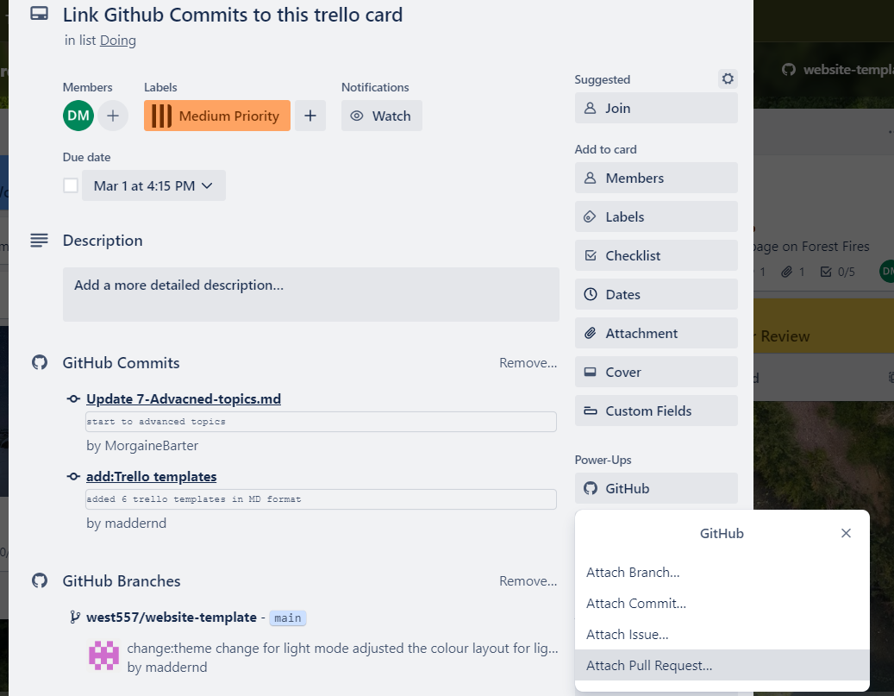
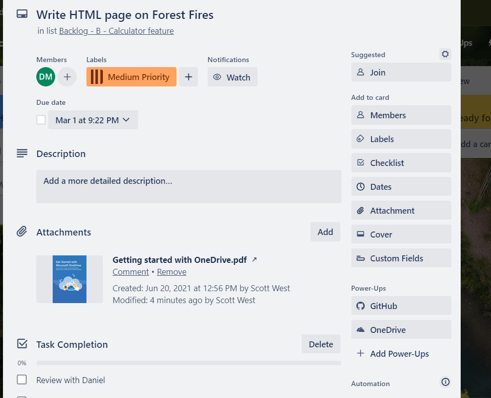
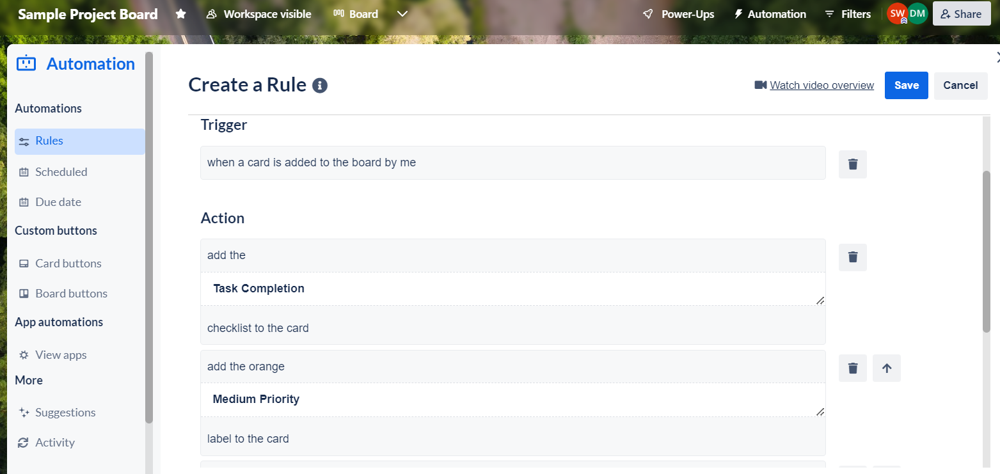

# Powerups and Automations

## Overview

Powerups and automations are very useful features. Powerups facilitate integration with other prominent IT platforms enhancing project workflow and collaboration. Automations help to automate mundane and time-consuming administration tasks. These features save valuable time and effort for project work.

## Watch our Video Tutorial

Check out the below video covering finding, adding and using powerups. Creating automations to streamline administration work is also covered.

*Link: https://youtu.be/ZE_C6lTeZvA*

## Powerups

Powerups are integrations you can add to your Trello board so you can manage the board across other IT applications. This allows for enhanced workflow integration. Four excellent powerups to use during the capstone university program are: Github, Storypoints, Microsoft Teams and OneDrive.

**Adding Power-Ups**

- Go to the board menu; click Power-Ups; Add powerups; and search for the ones you need;
- Click "Add" to integrate the particular powerup into your board.

**GitHub**
- The Github powerup allows a capstone student to track everything happening within Github directly from the Trello board. This allows the student to attach pull requests, issues, branches and commits directly to the respective cards enhancing organisation. Other team members can easily see your Git requests and provide assistance when required. 

*To use the powerup:*
- Search and add Github powerup from the main board, 
- on a relevant card click Github powerup and log in,
- Attach either a branch, commit, issue or pull request, 
- A link will now show on the card to the Github request. 

**Story Points**
- Story Points are used to assign the weight for a task, measure the task difficulty and the overall amount of work required. As the amount of story points increases in conjunction the task difficulty level or overall work increases. When we assign the story points for each task then we can get the overview of the total work required for the project and the breakdown of project work by task. 

**Microsoft Teams**
- Microsoft Teams is another handy powerup which can be linked to the Trello Account during capstone. Integrating the Microsoft Teams powerup within Trello allows you to manage the Board within the Microsoft Teams environment. Collaboration with team members on cards and project files is therefore enhanced.

**OneDrive**
- OneDrive allows you to connect the Trello Board directly to one or multiple OneDrive accounts. As a result, a capstone student can directly attach files or folders from OneDrive to a card.

**Further Powerup Information**
- Some other good powerups for capstone are Gmail and Calendar View. Still, there are many more to explore so ensure you review the powerups feature. A sample card is below with the Github and OneDrive powerup links for workflow efficiency. Here is a guide for using Trello Powerups _(https://trello.com/guide/integrate-apps#do-more-with-power-ups)_.

_Figure 1: A sample capstone card with powerups_

## Compulsory Power-Ups for Development Teams

### Story Points

- **Purpose**: Enables teams to estimate the effort or complexity of tasks using story points, a
  fundamental aspect of agile project management.
- **How to Use**: After adding the Story Points Power-Up, you can assign point values to each card.
  This facilitates sprint planning and workload management by allowing teams to assess the effort
  required for tasks at a glance.

### GitHub

- **Purpose**: Integrates your GitHub repositories with your Trello boards, linking commits, pull
  requests, and issues to Trello cards. This synchronization enhances transparency and communication
  between development and project management efforts.
- **How to Use**: With the GitHub Power-Up enabled, connect your GitHub account and link
  repositories to your Trello board. You can then attach GitHub issues, pull requests, and more
  directly to cards, making it easy to track development progress alongside your project management
  activities.

## Leveraging Power-Ups for Project Success

### Story Points and GitHub Integration

Incorporating Story Points and GitHub into your Trello boards provides a dual advantage: precise
workload estimation through story points and seamless integration of development workflows with
GitHub. This combination is particularly powerful for teams practicing agile methodologies, as it
bridges the gap between project management and code development.

### Best Practices

- **Regularly Review Story Points**: Regularly assess the story points assigned to tasks to ensure
  they reflect the current understanding of the task's complexity.
- **Keep GitHub Links Updated**: Ensure that links between Trello cards and GitHub issues or PRs are
  kept current to maintain clarity on project status.

Power-Ups like Story Points and GitHub are essential for development teams using Trello to manage
projects. By facilitating agile practices and integrating closely with development workflows, these
Power-Ups empower teams to achieve greater efficiency, clarity, and alignment in their projects.
Explore these and other Power-Ups to fully harness the capabilities of Trello in your project
management endeavors.

## Automations

Trello has an in-built automation system called Butler which is helpful for completing mundane administration work. This feature can help remove a lot of the tedious tasks so you can focus instead on completing your project work. 

With automation you can create the following rules:

- **Rules** that instantly run a set of actions when triggered by a defined action,
- **Buttons** that run an action on a card or across an entire board in a single click,
- **Due date** commands that run-in relation to approaching or past due dates,
- **Calendar** commands that run at set calendar intervals.

In the below example tailored to capstone, a typical automation rule has been created to complete the administration to set up a card. When I create a card, the automation performs a set of routine administration tasks. It adds a due date for the end of the trimester, a comment, a medium priority and web development label, and a star along with another team member. These automations save time and ensure consistency across created cards.

_Figure 2: Creating a Trello automation rule_

Check out this useful video on creating automation rules in Trello: *https://www.youtube.com/watch?v=WSMfGoXrL9I*

## Conclusion

Congratulations on learning how to use powerups and automations for enhanced workflow management.

## References

- _Chapter 4: Integrate Trello with other apps_, Integrate Apps, Atlassian Trello 2024, accessed 6th of February 2024, *https://trello.com/guide/integrate-apps#do-more-with-power-ups*
- _Chapter 7: Automate anything in Trello_, Guide: Automate Anything, Atlassian Trello 2024, accessed 6th of February 2024, *https://trello.com/guide/automate-anything*
- Trello (Published Mar 22, 2023), _Making an Automation: Create Board Rules_, YouTube 2024, Available at: *https://www.youtube.com/watch?v=WSMfGoXrL9I* (accessed 6th of February 2024).
