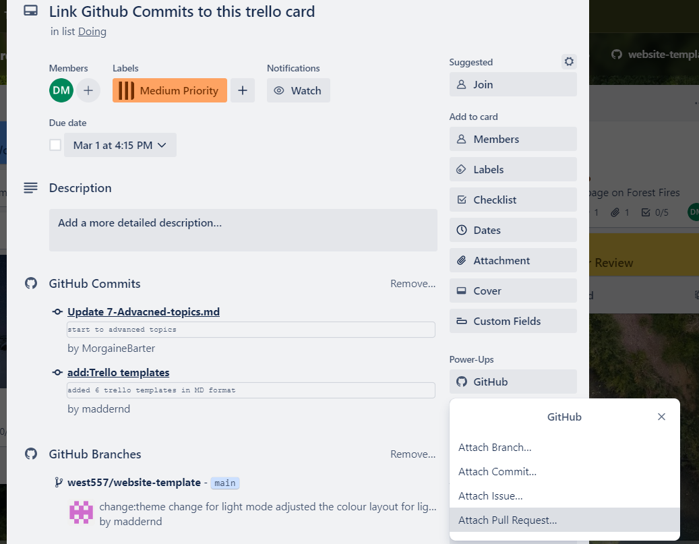
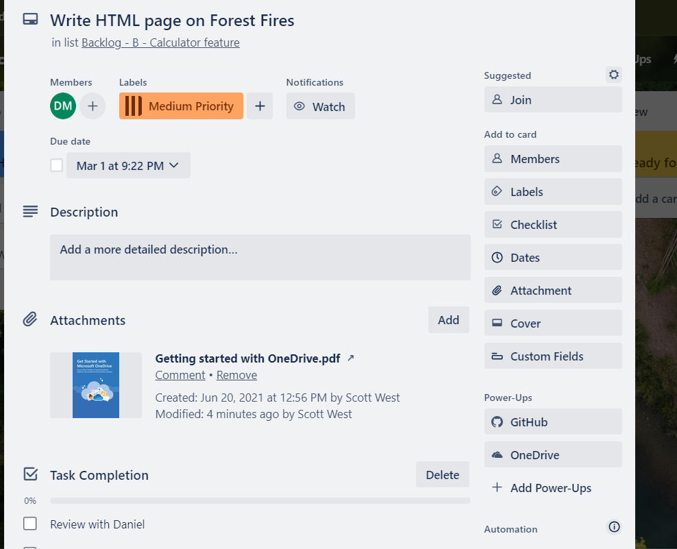
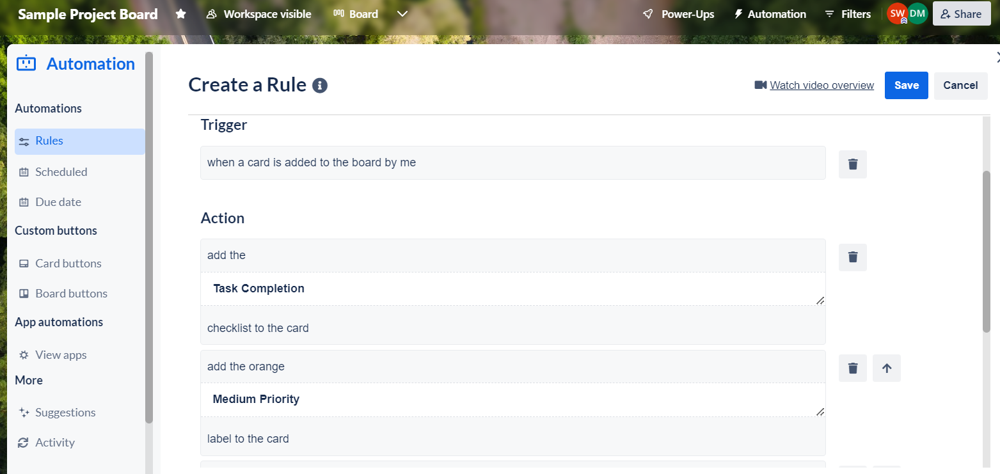

# Powerups and Automations

## Overview

Powerups and automations are useful features for a capstone student. A benefit is they help you to automate mundane and time-consuming administration tasks. Integration with other prominent IT platforms enhances project workflow and collaboration. Buttons within Trello allow you to do many sets of tasks with an easy click. These features save valuable time and effort for capstone project work and are definitely worth checking out.

## Watch our Video Tutorial

Check out the below video. It covers learning how to find, add and use powerups for enhanced workflow management on your Trello Board. Creating automations to streamline administration work is also covered.

*Link:*

## Powerups

Powerups are integrations you can add to Trello so you can manage the board across other IT applications. This allows for enhanced workflow integration. Three excellent powerups for a capstone student are: Github, Microsoft Teams and OneDrive.

**Adding Power-Ups**

- Go to the board menu, click "Power-Ups," and browse or search for the ones you need.
- Click "Add" to integrate them into your board.

**GitHub**
- The Github powerup allows a capstone student to track everything happening within Github directly from the Trello board. This allows the student to attach pull requests, issues, branches and more directly to the respective cards which is handy for monitoring card progress. Other team members can easily see your Git requests and provide assistance when required. Through this you can link all of your programming work directly to the Trello Card.

To use the powerup:  
- Search and add Github powerup from the main board, 
- on a relevant card click Github powerup,
- Log in and navigate to the repository in Github, 
- Attach either branch, commit, issue or pull request. 
- A link will be on the card to the Github branch, commit, issue or pull request. 

**Microsoft Teams**
- Microsoft Teams is another handy powerup which can be linked to the Trello Account during capstone. Integrating Trello within Microsoft Teams allows, you as a capstone student to efficiently manage the Trello Board from within the Microsoft Teams environment. Collaboration with team members on cards and project files is therefore much easier through this powerup.

**OneDrive**
- A third valuable powerup is OneDrive. This allows you to connect the Trello Board directly to one or multiple OneDrive accounts. As a result, a capstone student can directly attach files or folders from OneDrive to a Trello card easily. This is useful for efficiency and keeping everyone updated on your work.

Some other good powerups for capstone are Gmail and Calendar View. Still there are many more to explore so ensure you review this feature. A sample card is below with the Github and OneDrive powerup links for workflow efficiency. Here is a guide for using Trello Powerups _(https://trello.com/guide/integrate-apps#do-more-with-power-ups)_.

_Figure 1: A sample capstone card with powerups_

## Automations

Trello has an in-built automation system called Butler which is helpful as a capstone student. This feature can help remove a lot of the tedious administration tasks so you can focus instead on completing your project work. Mundane administration is removed through automations that perform a variety of functions.

With automation you can create the following rules:

- **Rules** that instantly run a set of actions when triggered by a defined action,
- **Buttons** that run action on a card or across an entire board in a single click,
- **Due date** commands that run-in relation to approaching or past due dates,
- **Calendar** commands that run at set calendar intervals.

In the below example tailored to capstone, a typical automation rule has been created to complete the back-end administration so I can focus more time on project workflow. When I create a card, the automation performs a set of routine administration tasks. It adds a due date for the end of the trimester, a comment, a medium priority and web development label, and a star along with another team member. These automations save time and ensure consistency across created cards.

_Figure 2: Creating a Trello automation rule_

Check out this useful video on creating automation rules in Trello: *https://www.youtube.com/watch?v=WSMfGoXrL9I*

## Conclusion

Congratulations on finishing this section and learning how to use integrations for more tailored workflow management.

## References

- _Chapter 4: Integrate Trello with other apps_, Integrate Apps, Atlassian Trello 2024, accessed 6th of February 2024, *https://trello.com/guide/integrate-apps#do-more-with-power-ups*
- _Chapter 7: Automate anything in Trello_, Guide: Automate Anything, Atlassian Trello 2024, accessed 6th of February 2024, *https://trello.com/guide/automate-anything*
- Trello (Published Mar 22, 2023), _Making an Automation: Create Board Rules_, YouTube 2024, Available at: *https://www.youtube.com/watch?v=WSMfGoXrL9I* (accessed 6th of February 2024).
