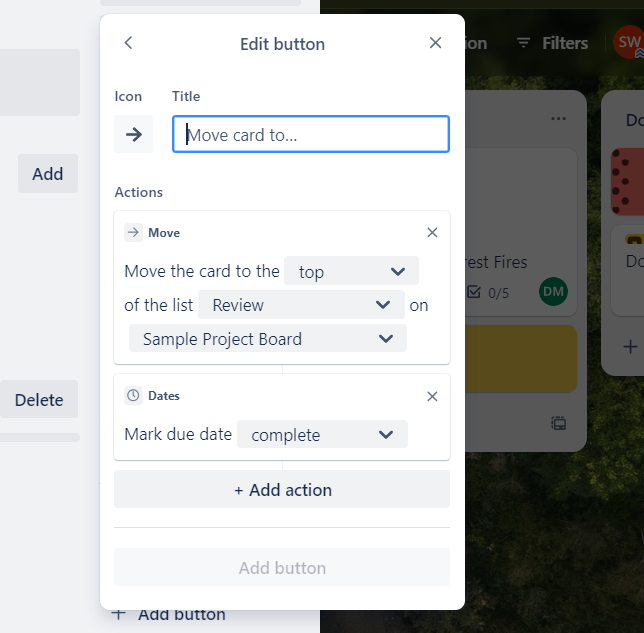
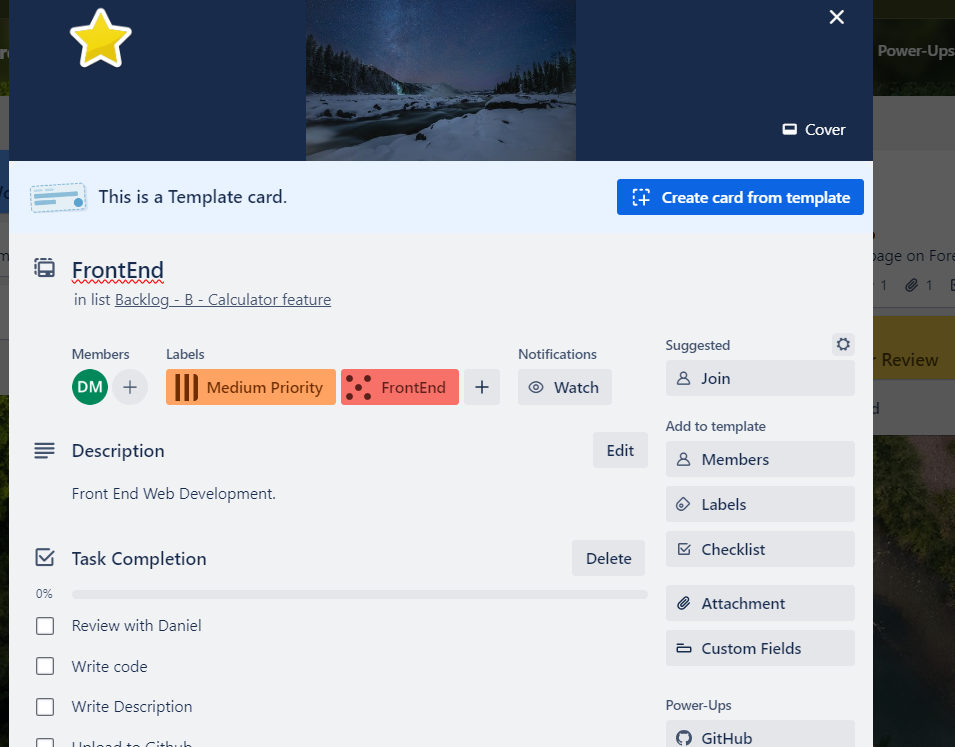

## Overview

Through Trello you can create tailored functionality for a particular project. Tailored buttons can
be created based on a project's requirements and workflow. Card Templates can be set-up facilitating
organisation and consistency. Reviewing from the View is another option to help manage important
deadlines. Finally, there are lots of helpful resources online to further enhance your Trello and
project management skills.

## Watch our Video Tutorial

Check out the below video covering buttons, templates and helpful Trello resources.

_Link: https://youtu.be/E_xOCkFamIo_

## Buttons

Buttons are handy since they allow you, with a single click to manage automation rules and
workflows. To create a button, open the card and select the _Add Button_ tab under _Automation_. The
prompts can then be followed to create the button actions. For example, in the below screenshot, I
created a button to move a card to the top of the review list and mark the task as complete. This
means when a task is ready to be reviewed, I can easily perform the administration required.

_Figure 1: Review Button_

## Card Templates

Card templates are a great option within capstone for building a repeatable, clear and consistent
workflow. Formalisation through templates allows for effective organisation, ensuring no important
actions are missed.

In order to create a card template, all you need to do is click the _Create a new Template_ icon at
the bottom right of any list. From the template card back, you can create a set of elements that are
copied to any template created card. Some items that you can add to a card template include:
attachments, covers, members, checklists, labels and custom fields. In addition, if you would like
to convert a particular card to a template you can do this through the _Make Template_ button in the
bottom right corner of the open card.

It is recommended to create a template for particular categories of tasks requiring completion. A
sample card template is below for any Front-End web development tasks requiring documentation. This
template will have a checklist for task completion, appropriate labels, members who will be added
automatically to the new card on creation (such as the web development lead), along with a cover for
visual presentation and organisation.

In essence, card templates are a great way for ensuring consistency and clarity within the Trello
board.

_Figure 2: Template Front End Web Development Card_

## View

The main idea behind the View feature is to provide a calendar incorporating the project workflows
and key deadlines. This effectively manages tasks and displays project information for workflow
planning. Views make it easy to display your data across boards and teams in a clear and actionable
way.

This allows you to stay on top of due dates within the calendar view, and sync with your personal
calendar for project-life balance. This can be accessed through clicking Workspace Views then
Calendar. Note this is a feature of Trello Premium (_Trello Blog 2024_).

## Helpful Resources

There are many great resources to fully explore the features of Trello and enhance your project
management skills. Some helpful resources are listed below:

- Creating and managing a Trello Board
  _(https://www.youtube.com/watch?v=9OngFw0Q3Zg&list=PL4H_oPRK80z6st7sR7xeoI5hY4p6NFsFz)_;
- Trello Essential Training, a LinkedIn Learning course
  _(https://www.linkedin.com/learning/trello-essential-training-22650139?u=2104084)_;
- The Atlassian Work Life blog, providing many helpful articles to enhance your office productivity
  and IT savoir _(https://www.atlassian.com/blog)_;
- Setting up Trello as a productivity dashboard
  _(https://www.atlassian.com/blog/productivity/trello-productivity-guide)_;
- The Trello YouTube channel, providing excellent walk-through videos
  _(https://www.youtube.com/@trello)_;
- New to Trello Guide
  _(https://trello.com/guide?utm_source=trello&utm_medium=inapp&utm_content=header-tips&utm_campaign=guide)_;
- Advanced Checklists for Managing Cards
  _(https://www.atlassian.com/blog/trello/advanced-checklists)_;
- Your Personality at Work Newsletter
  _(https://www.atlassian.com/blog/collections/personality-at-work)_;
- Lightweight Ways to Customize Trello
  _(https://www.atlassian.com/blog/trello/lightweight-ways-to-customize-trello)_.

## Conclusion

You have now learnt how to create buttons, set up card templates and explored helpful Trello
resources. Great work!

## References

- Trello Blog (Published June 28, 2023), Lightweight ways to customize Trello, Atlassian 2024,
  accessed 3rd of February 2024,
  _[Lightweight ways to customize Trello - Work Life by Atlassian](https://www.atlassian.com/blog/trello/lightweight-ways-to-customize-trello)_
- Trello Blog (Published June 12, 2020 In Trello), Lightweight ways to customize Trello, Product &
  News, Atlassian 2023, accessed 3rd of February 2024,
  _[5 Trello features that will change the way you work - Work Life by Atlassian](https://www.atlassian.com/blog/trello/trello-features-change-the-way-you-work)_
- ‘What is Trello’, Trello Home, Atlassian 2024, accessed 3rd of February 2024,
  _[What is Trello: Learn Features, Uses & More | Trello](https://trello.com/tour)_
- Trello (Published: 1 Dec 2022), Trello Shorts Playlist, YouTube 2024, Available at:
  https://www.youtube.com/watch?v=9OngFw0Q3Zg&list=PL4H_oPRK80z6st7sR7xeoI5hY4p6NFsFz (Accessed 10th
  of February 2024)
- Trello (Published January 31, 2023), Advanced checklists: the better way to track Trello board
  tasks, Atlassian: Product and News 2024, https://www.atlassian.com/blog/trello/advanced-checklists
  (accessed 10th of February 2024)
- Work life by Atlassian (2023), Your Personality at Work Navigating and celebrating the
  complexities of our individuality. Atlassian 2023,
  https://www.atlassian.com/blog/collections/personality-at-work (accessed 11th of February 2024)
- Arnold Z. (Course Released: 20th of July 2023), Trello Essential Training, LinkedIn Learning 2024,
  https://www.linkedin.com/learning/trello-essential-training-22650139?u=2104084 (accessed 11th of
  February 2024)
