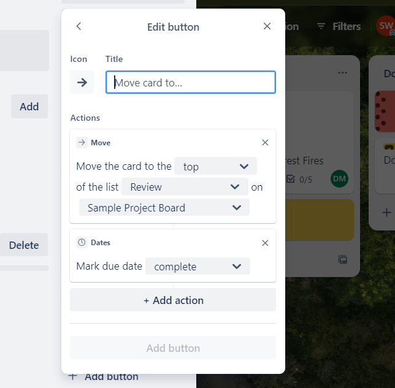
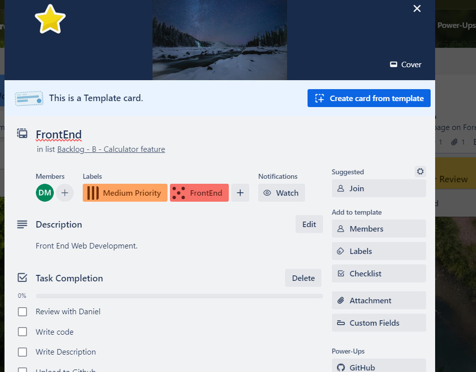

# Advanced Functionality & Tips

## Overview

Trello has a lot of advanced features and functionality which can be very handy as a capstone student. Each project has different requirements and workflow. So, it can be a good idea to look into creating tailored buttons for a particular project. Card Templates facilitate clarity and streamline project organisation for consistency. Reviewing from the View is another option to help manage important deadlines. Finally, there are lots of IT newsletters, Atlassian blogs and guides for using Trello, so keep exploring this excellent tool.

## Watch our Video Tutorial

Check out the below video going over advanced workflow functionality along with helpful resources for using Trello.

*Link:*

## Buttons

Custom made buttons are a feature of Trello to consider using within capstone. Buttons are handy since they allow you to do one simple click to perform automation rules, powerups and workflows from either the board or a card. To create a button, open the card and select the Add Button feature under automation. The prompts can then be followed to create the button settings. For example, in the below screenshot I created a button to move a card to the top of the review list and mark the task as complete. This means when a task is complete, I can select this button so all completed tasks are in the one place with similar labels.

_Figure 1: Review Button_

## Card Templates

Card templates are a great option within capstone for building a repeatable, clear and consistent workflow. Formalisation through templates allows for effective organisation, ensuring no important details from the project are missed.

In order to create a card template, all you need to do is click the “Create a new Template” icon at the bottom right of the card. From the template card back, you can create a set of elements that are copied to any created card. Some items that you can add to a card template include: attachments, cover, members, checklists, labels and custom fields. In addition, if you would like to convert a particular card to a template you can do this through the ‘Make Template’ button. This is a good option to consider if you keep copying many features from one particular card.

A suggestion within capstone is to create a template for particular types of tasks requiring completion. Let’s create a sample card template for any Front-End web development tasks requiring documentation. This template will have a checklist for task completion, appropriate labels, members who will be added automatically to the new card on creation (such as the web development lead), along with a cover for visual presentation and organisation. The template has been created below and can now be used for any new web development tasks required.

In essence, card templates are a great way for ensuring consistency and clarity within the Trello board.

_Figure 2: Template Front End Web Development Card_

## View

The main idea behind the view feature is to provide a calendar incorporating the project workflows and key deadlines. This effectively manages tasks and displays project information for workflow planning. Views make it easy to display your data across boards and teams in a clear and actionable way.

This allows you to stay on top of due dates within the calendar view, and sync with your personal calendar for project-life balance. This can be accessed through clicking Workspace Views then Calendar. Note this is a feature of Trello Premium so some students may not have access (_Trello Blog 2024_).

## Helpful Resources

There are many great resources to fully explore the features of Trello. Some helpful resources are listed below:

- Creating and managing a Trello Board _(https://www.youtube.com/watch?v=9OngFw0Q3Zg&list=PL4H_oPRK80z6st7sR7xeoI5hY4p6NFsFz)_;
- Trello Essential Training, a LinkedIn Learning course (https://www.linkedin.com/learning/trello-essential-training-22650139?u=2104084)*;
- The Atlassian Work Life blog, providing many helpful articles to enhance your office productivity and IT savoir (https://www.atlassian.com/blog)*;
- Here is an article with some great tips on setting up a Trello Board as a productivity dashboard (https://www.atlassian.com/blog/productivity/trello-productivity-guide)*;
- The Trello YouTube channel has excellent walk-through videos showing advanced features (https://www.youtube.com/@trello)*;
- New to Trello Guide is excellent for exploring the features on offer (https://trello.com/guide?utm_source=trello&utm_medium=inapp&utm_content=header-tips&utm_campaign=guide)*;
- Advanced Checklists for Managing Cards (https://www.atlassian.com/blog/trello/advanced-checklists)*;
- Your Personality at Work Newsletter (https://www.atlassian.com/blog/collections/personality-at-work)*;
- Lightweight Ways to Customize Trello (https://www.atlassian.com/blog/trello/lightweight-ways-to-customize-trello)\*.

## References

- Trello Blog (Published June 28, 2023), Lightweight ways to customize Trello, Atlassian 2024, accessed 3rd of February 2024, _[Lightweight ways to customize Trello - Work Life by Atlassian](https://www.atlassian.com/blog/trello/lightweight-ways-to-customize-trello)_
- Trello Blog (Published June 12, 2020 In Trello), Lightweight ways to customize Trello, Product & News, Atlassian 2023, accessed 3rd of February 2024, _[5 Trello features that will change the way you work - Work Life by Atlassian](https://www.atlassian.com/blog/trello/trello-features-change-the-way-you-work)_
- ‘What is Trello’, Trello Home, Atlassian 2024, accessed 3rd of February 2024, _[What is Trello: Learn Features, Uses & More | Trello](https://trello.com/tour)_
- Trello (Published: 1 Dec 2022), Trello Shorts Playlist, YouTube 2024, Available at: https://www.youtube.com/watch?v=9OngFw0Q3Zg&list=PL4H_oPRK80z6st7sR7xeoI5hY4p6NFsFz (Accessed 10th of February 2024)
- Trello (Published January 31, 2023), Advanced checklists: the better way to track Trello board tasks, Atlassian: Product and News 2024, https://www.atlassian.com/blog/trello/advanced-checklists (accessed 10th of February 2024)
- Work life by Atlassian (2023), Your Personality at Work Navigating and celebrating the complexities of our individuality. Atlassian 2023, https://www.atlassian.com/blog/collections/personality-at-work (accessed 11th of February 2024)
- Arnold Z. (Course Released: 20th of July 2023), Trello Essential Training, LinkedIn Learning 2024, https://www.linkedin.com/learning/trello-essential-training-22650139?u=2104084 (accessed 11th of February 2024)
